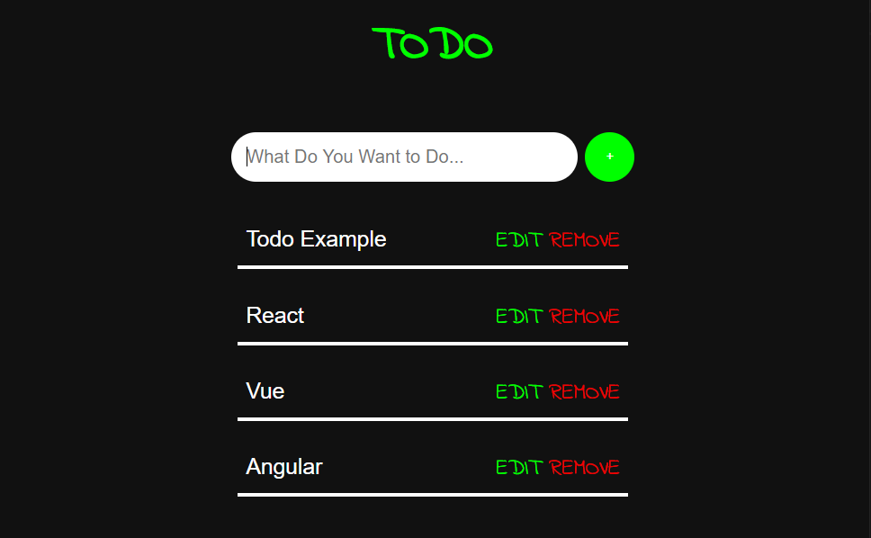

# 😀 pureJavascript-Todo-List

## This is a TODO example in pure JavaScript.
 

# 👩‍💻 RESULT

# ✍🏽  What I know

## [o] I can see how dom works.  
    - (ps. createElement, addEventListener, querySelector, appendChild, classList, innerHTML, parentNode.removeChild)  
## [o] I can learn about Class in JavaScript.  
    - (ps. constructor)  
## [o] I can use the browser's local storage.  
    - (ps. window.localStorage.setItem, window.localStorage.getItem)  
## [o] I can see the JSON built-in library.  
    - (ps.  JSON.stringify)  
 